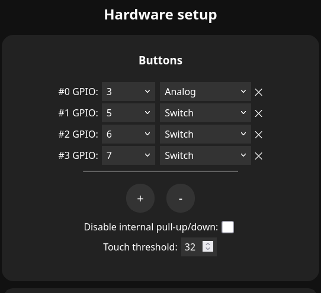
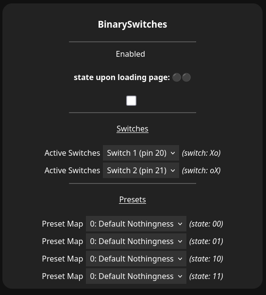
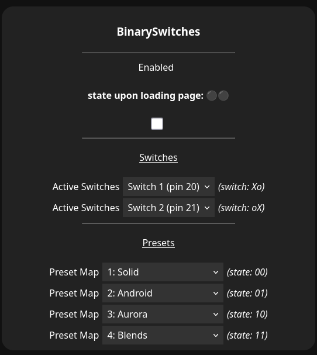

# WLED binary switches usermod

This repository is a [WLED](https://github.com/wled/WLED) usermod for switching presets (with physical switches) in a binary integer pattern.
```
Example with 3 switches (either on (1) or off (0))
 --Switches--   --WLED--
        0 0 1 → Preset 1
        0 1 1 → Preset 3
        1 0 0 → Preset 4
```

## Installation

Follow the docs: [advanced/custom-features/](https://kno.wled.ge/advanced/custom-features/)  
to set up the compilation environment.
```ini
  ;;platformio_override.ini;;
[env:my_build]
extends = env:esp32dev
custom_usermods = 
  ${env:esp32dev.custom_usermods}
  https://github.com/snaens/wled-usermod-binary-switches.git
```

> [!TIP]
> don't forget to press reset if your board doesn't do it automatically

> [!TIP]
> You can use [the wled installer](https://install.wled.me/) to configure wifi once the upload is finished.  
> simply click `install`, select the serial port,  
> then (given the installation was successful) click `connect to wifi` 


## Usage

1. set up some switches the usual way:  
  
2. go to `usermods`.  
  select the order of your switches (order to string them into binary):  
  
3. select the presets to load at for the binary states:  
   (make sure to create some presets to use)  
  
4. hit save! Done!
